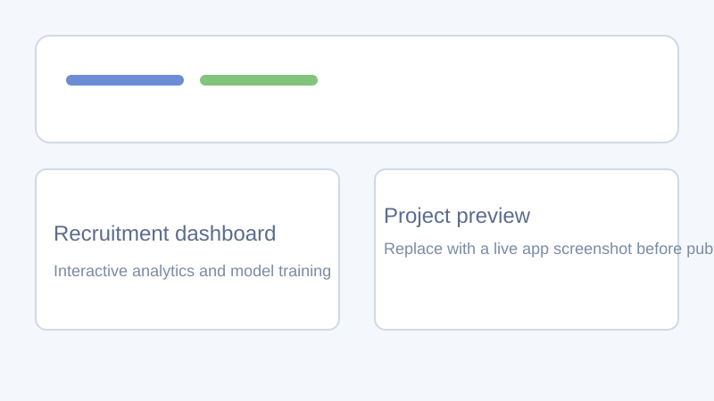

# CRSsNP Physician-Site Recruitment Dashboard

A Streamlit application for exploring physician-site recruitment fit in clinical research studies. The project combines interactive analytics with a lightweight classification workflow to surface likely high-fit matches.

## Project summary

This dashboard is designed as a practical data product sample. It lets a reviewer explore the dataset, inspect recruitment trends, retrain the classifier, and generate new physician-site match predictions from the UI.

## Features

- Multi-page Streamlit dashboard for analytics and search
- Interactive filtering by specialty, study, and predicted match label
- Search workflows for physician IDs and site IDs
- Model insights with feature importance and agreement checks
- In-app model retraining and single-record prediction form
- Automated tests for data utilities, training, and prediction flow

## Tech stack

- Python 3.13
- Streamlit
- pandas
- scikit-learn
- Plotly
- joblib

## Repository structure

- `streamlit_app.py` - top-level Streamlit entry point
- `app.py/streamlit_app.py` - main dashboard implementation
- `models/train.py` - model training pipeline
- `models/predict.py` - model loading and prediction wrapper
- `utils/data.py` - data loading and preprocessing helpers
- `tests/` - automated test coverage
- `crssnp_recruitment_data.csv` - sample recruitment dataset

## Getting started

### 1. Create and activate the virtual environment

```powershell
python -m venv .venv
Set-ExecutionPolicy -Scope Process -ExecutionPolicy RemoteSigned
& .\.venv\Scripts\Activate.ps1
```

### 2. Install dependencies

```powershell
python -m pip install -r requirements.txt
```

### 3. Run the dashboard

```powershell
python -m streamlit run .\streamlit_app.py
```

## App preview



The current repository includes a lightweight preview illustration. Replace it with a real screenshot or short GIF before using the project in a final application packet.

## Model behavior

The training pipeline uses `match_label` as the primary target when it exists in the dataset and falls back to `predicted_match_label` only for reduced demo datasets that do not include ground-truth labels. This keeps the main project narrative aligned with a real supervised learning workflow.

## Training the model

You can retrain the classifier from either the terminal or the app.

```powershell
python models/train.py
```

In the UI, open `Train Model` and click `Train Model`.

## Running tests

Install development dependencies and run the suite from the project root.

```powershell
python -m pip install -r requirements-dev.txt
pytest
```

## Deployment

The app can be deployed to Streamlit Community Cloud.

1. Push the project to GitHub.
2. Create a new app in Streamlit Community Cloud.
3. Set the entry point to `streamlit_app.py`.

## Portfolio checklist

- [x] Interactive dashboard with multiple workflows
- [x] Documented setup, testing, and deployment steps
- [x] Automated tests that run from the project root
- [x] Reproducible model training pipeline
- [x] Public license included
- [ ] Replace the preview illustration with a real product screenshot or GIF

## Future improvements

- Add cross-validation and richer evaluation reporting
- Add data dictionary documentation for the recruitment fields
- Add exportable model evaluation artifacts
- Add a hosted demo URL once deployed

## Contributing

See `CONTRIBUTING.md` for local development and testing guidance.

## License

Released under the MIT License. See `LICENSE` for details.
